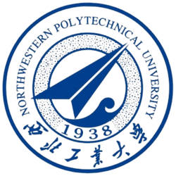

# Online Portfolio

Personal portfolio website for **MD RAKIBUL ISLAM RAIHAN** — ML Systems Engineer targeting 2027 New Grad roles in **LLM Inference / Multimodal AI** across Mainland China & Hong Kong (MNC & global AI R&D).

🔗 **Live site:** https://theraihanrakibb.github.io/Online-Portfolio/

## Highlights

- **Single-file `index.html`** — all markup, inline `<style>`, and inline `<script>`. No build step, zero runtime dependencies.
- **Bilingual** 🇬🇧 / 🇨🇳 EN / 中文 toggle with `localStorage` persistence.
- **Dark / light theme** toggle.
- Animated hero with profile photo, availability pill, and a typed rotating-role effect.
- Impact stats strip (KV-cache hit rate, TTFT reduction, FP4 memory, OSS repos) + scroll-reveal transitions.
- **11 projects** rendered from a data array with filter chips (10 AI-infra repos + a C compiler).
- Education cards linking both theses; Research section featuring NVFP4-DiT and both theses.
- Open Graph / Twitter Card meta, inline SVG favicon, responsive layout.

## Structure

- `index.html` — the entire site (markup + styles + logic).
- `assets/Raihan.png` — profile photo.
- `assets/og-image.png` — 1200×630 social preview image.
- `assets/images/nwpu-seal.png` — Northwestern Polytechnical University seal shown on the education cards.
- `assets/resume/Resume_Raihan_MLSys_NWPU_2027.pdf` — bilingual 2027 NWPU M.Eng. resume (English + 中文, 2 pages).
- `assets/resume/CL_Raihan_MLSys_NWPU_2027.pdf` — bilingual cover letter (English + 中文, 2 pages).
- `assets/resume/Resume_Raihan_NWPU_MS_2027.docx` — editable Word version of the resume.

## Run locally

Open `index.html` directly in a browser, or serve it statically:

```bash
python -m http.server 8000
# then visit http://localhost:8000
```

## Deployment

Deployed on **GitHub Pages**. Push to the `main` branch — changes go live within ~1 minute.

## Education

<p align="center">
  <a href="https://www.nwpu.edu.cn/" title="Northwestern Polytechnical University (NWPU)"></a>
  <br/>
  <b><a href="https://www.nwpu.edu.cn/">Northwestern Polytechnical University (NWPU)</a></b> · Xi'an, China · 985 / 211
</p>

- **M.Eng. in Software Engineering** — School of Software, [Northwestern Polytechnical University (NWPU)](https://www.nwpu.edu.cn/), Sep 2024 – Jul 2027 · GPA 88/100 (Top 1%).
  Thesis: [Detecting Deepfake Video by a Multimodal Audio-Visual Framework with Temporal Inconsistencies](https://github.com/theraihanrakibb/M.Eng-Thesis-Multimodal-Deepfake-Audio-Visual-Temporal-Framework)
- **B.Eng. in Computer Science & Technology** — School of Computer Science, [Northwestern Polytechnical University (NWPU)](https://www.nwpu.edu.cn/), Sep 2020 – Jul 2024 · GPA 85/100 (Top 1%).
  Thesis: [Design and Implementation of a Distributed Confidential Query Protocol for Spark](https://github.com/theraihanrakibb/B.Eng-Thesis-Design-and-Implementation-of-a-Distributed-Confidential-Query-Protocol-for-Spark)

## Related

- Profile: [@theraihanrakibb](https://github.com/theraihanrakibb)
- Research: [NVFP4-DiT](https://github.com/theraihanrakibb/NVFP4-DiT) · [M.Eng. Thesis](https://github.com/theraihanrakibb/M.Eng-Thesis-Multimodal-Deepfake-Audio-Visual-Temporal-Framework) · [B.Eng. Thesis](https://github.com/theraihanrakibb/B.Eng-Thesis-Design-and-Implementation-of-a-Distributed-Confidential-Query-Protocol-for-Spark)
